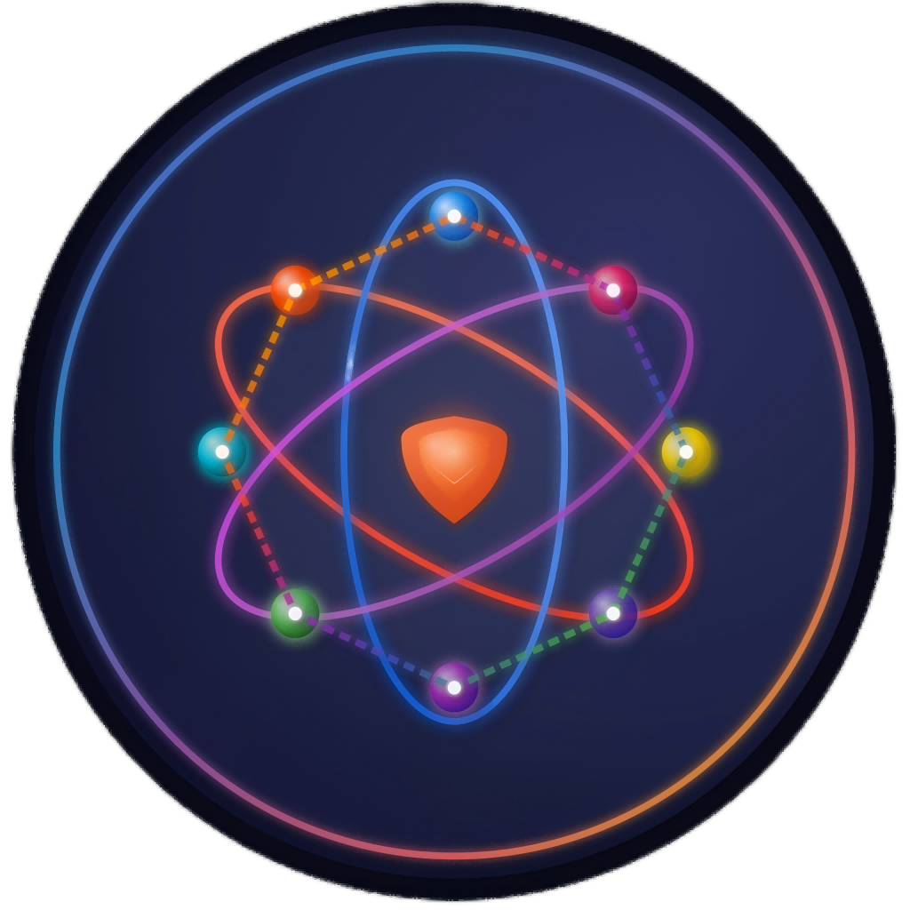

# SecMaze

<p align="center">
  
</p>

<h3 align="center">Advanced Security Maze Challenge Platform</h3>
<p align="center">Blockchain-powered security maze challenges for identifying automated attacks</p>

<p align="center">
  <a href="#-features">Features</a> •
  <a href="#-architecture">Architecture</a> •
  <a href="#-tech-stack">Tech Stack</a> •
  <a href="#-installation">Installation</a> •
  <a href="#-data-flow">Data Flow</a> •
  <a href="#-key-components">Key Components</a> •
  <a href="#-contributing">Contributing</a> •
  <a href="#-license">License</a>
</p>

## ✨ Features

- **🧩 Adaptive Challenge Engine**: Dynamically adjusts maze complexity based on user behavior patterns
- **🔐 Multi-level Verification**: Combines multiple verification mechanisms for enhanced security
- **🤖 Machine Learning Analysis**: Analyzes interaction patterns to detect automated solvers
- **⛓️ Blockchain Integration**: Decentralized threat intelligence sharing via blockchain
- **💰 Token Incentives**: Earn tokens for completing challenges and contributing security data
- **📊 Interactive Dashboard**: Track your performance and maze solving statistics
- **🎮 Interactive UI**: Intuitive maze navigation with keyboard, mouse, and touch support
- **🌓 Dark/Light Theme**: Customizable interface with theme preferences

## 🏗️ Architecture

SecMaze follows a modern, scalable architecture that separates frontend and backend concerns while integrating blockchain and machine learning components.

```
SecMaze/
├── src/                     # Source code
│   ├── frontend/            # Next.js frontend application
│   │   ├── components/      # Reusable UI components
│   │   ├── contexts/        # React context providers
│   │   ├── hooks/           # Custom React hooks
│   │   ├── pages/           # Next.js pages
│   │   ├── public/          # Static assets
│   │   ├── styles/          # CSS modules
│   │   └── utils/           # Utility functions
│   │
│   ├── backend/             # Express.js backend
│   │   ├── controllers/     # API controllers
│   │   ├── middleware/      # Express middleware
│   │   ├── models/          # Database models
│   │   ├── routes/          # API routes
│   │   ├── services/        # Business logic
│   │   └── utils/           # Utility functions
│   │
│   ├── blockchain/          # Blockchain integration
│   ├── maze/                # Maze generation & analysis
│   └── ml/                  # Machine learning components
│
├── docs/                    # Documentation
├── scripts/                 # Build & deployment scripts
└── tests/                   # Test suite
```

<p align="center">
  
</p>

## 🛠️ Tech Stack

### Frontend
- **React**: UI library for building component-based interfaces
- **Next.js**: React framework for server-side rendering and static site generation
- **CSS Modules**: Scoped styling for components
- **React Context API**: State management for authentication and theme
- **Custom Hooks**: Reusable logic for localStorage, media queries, etc.

### Backend
- **Express.js**: Web server framework for Node.js
- **MongoDB**: NoSQL database for storing user data and maze configurations
- **JWT**: JSON Web Tokens for authentication
- **Socket.IO**: Real-time bidirectional communication

### Blockchain
- **Ethereum**: Smart contracts for token rewards and threat sharing
- **Web3.js**: Library for interacting with Ethereum blockchain

### Machine Learning
- **TensorFlow.js**: Machine learning for detecting automated solvers
- **Natural Language Processing**: For analyzing interaction patterns

## 📥 Installation

```bash
# Clone the repository
git clone https://github.com/SecMaze-AI/SecMaze.git

# Navigate to project directory
cd SecMaze

# Install dependencies
npm install

# Set up environment variables
cp .env.example .env

# Start development server
npm run dev
```

## 🔄 Data Flow

The SecMaze platform operates with the following data flow:

1. **User Registration/Authentication**
   - Users register and receive JWT tokens for authenticated requests
   - Authentication state is managed through React Context API

2. **Maze Generation**
   - User requests maze with specific difficulty or seed
   - Backend generates maze with specified parameters
   - Maze data is sent to frontend for rendering

3. **User Interaction**
   - User navigates maze using keyboard, mouse, or touch
   - Interactions are tracked and analyzed in real-time
   - Solution attempts are validated on backend

4. **Machine Learning Analysis**
   - Interaction patterns are collected and analyzed
   - ML models identify potential automated solvers
   - Unusual patterns trigger additional verification challenges

5. **Blockchain Integration**
   - Successful completions earn token rewards
   - Threat data is stored on blockchain for community sharing
   - Smart contracts manage token distribution and data verification

<p align="center">
  
</p>

## 🧩 Key Components

### 🎮 Maze Generator Component

The MazeGenerator is a core component responsible for creating, displaying, and tracking maze interactions:

```jsx
const MazeGenerator = ({ 
  initialDifficulty = 1, 
  width = 10, 
  height = 10,
  onComplete,
  trackData = true,
  initialSeed = null,
  onShare = null
}) => {
  // State management
  const [mazeData, setMazeData] = useState(null);
  const [difficulty, setDifficulty] = useState(initialDifficulty);
  const [seed, setSeed] = useState(() => initialSeed ? parseInt(initialSeed, 10) : Math.floor(Math.random() * 1000000));
  
  // Maze generation logic
  const generateMaze = useCallback(async (useCustomSeed = false) => {
    // Implementation details
  }, [difficulty, width, height, customSeed]);
  
  // User interaction tracking
  const handleMazeInteraction = async (interactionData) => {
    // Implementation details
  };
  
  // Rendering
  return (
    <div className={styles.mazeGeneratorContainer}>
      {/* Control UI */}
      {/* Maze display */}
      {/* Statistics and history */}
    </div>
  );
};
```

### 🔐 Authentication System

SecMaze implements a secure authentication system using JWT tokens and context API:

```jsx
export const AuthProvider = ({ children }) => {
  const [user, setUser] = useState(null);
  const [isLoading, setIsLoading] = useState(true);
  
  // Check for existing token on mount
  useEffect(() => {
    const checkAuth = async () => {
      try {
        const token = localStorage.getItem('authToken');
        if (token) {
          // Validate token and get user data
          const userData = await validateToken(token);
          setUser(userData);
        }
      } catch (error) {
        localStorage.removeItem('authToken');
      } finally {
        setIsLoading(false);
      }
    };
    
    checkAuth();
  }, []);
  
  // Authentication methods
  const login = async (credentials) => {
    // Implementation details
  };
  
  const register = async (userData) => {
    // Implementation details
  };
  
  const logout = () => {
    // Implementation details
  };
  
  return (
    <AuthContext.Provider 
      value={{ 
        user, 
        isAuthenticated: !!user, 
        isLoading, 
        login, 
        register, 
        logout 
      }}
    >
      {children}
    </AuthContext.Provider>
  );
};
```

### 🌓 Theme System

SecMaze includes a comprehensive theming system with light/dark mode support:

```jsx
export const ThemeProvider = ({ children }) => {
  // Store theme preference in localStorage
  const [themePreference, setThemePreference] = useLocalStorage('themePreference', THEME_MODES.SYSTEM);
  const [currentTheme, setCurrentTheme] = useState(THEME_MODES.DARK);
  
  // Apply theme to document
  useEffect(() => {
    const root = window.document.documentElement;
    root.classList.remove(THEME_MODES.LIGHT, THEME_MODES.DARK);
    root.classList.add(currentTheme);
    
    // Update meta theme-color for mobile browsers
    const metaThemeColor = document.querySelector('meta[name="theme-color"]');
    if (metaThemeColor) {
      metaThemeColor.setAttribute(
        'content',
        currentTheme === THEME_MODES.DARK ? '#1a202c' : '#ffffff'
      );
    }
  }, [currentTheme]);
  
  return (
    <ThemeContext.Provider value={{ 
      themePreference, 
      currentTheme, 
      setTheme,
      isDarkMode: currentTheme === THEME_MODES.DARK 
    }}>
      {children}
    </ThemeContext.Provider>
  );
};
```

### 🔄 Share System

SecMaze features a robust sharing system for challenging friends with the same maze:

```jsx
// Generate shareable URL for a maze
export const generateMazeShareUrl = (seed, difficulty) => {
  const baseUrl = window.location.origin + '/maze';
  return `${baseUrl}?seed=${seed}&difficulty=${difficulty}`;
};

// Generate social media sharing links
export const generateShareLinks = (url, options) => {
  const { seed, difficulty, hashtags } = options;
  
  const defaultText = `Can you solve this SecMaze challenge? Maze Seed: ${seed} Difficulty: ${difficulty}`;
  const shareText = title || defaultText;
  const encodedUrl = encodeURIComponent(url);
  const encodedText = encodeURIComponent(shareText);
  
  return {
    twitter: `https://twitter.com/intent/tweet?text=${encodedText}&url=${encodedUrl}`,
    facebook: `https://www.facebook.com/sharer/sharer.php?u=${encodedUrl}`,
    whatsapp: `https://api.whatsapp.com/send?text=${encodedText} ${encodedUrl}`,
    linkedin: `https://www.linkedin.com/sharing/share-offsite/?url=${encodedUrl}`,
    email: `mailto:?subject=Try this SecMaze Challenge&body=${encodedText} ${encodedUrl}`
  };
};
```

## 🤝 Contributing

We welcome contributions to SecMaze! Please follow these steps:

1. Fork the repository
2. Create a feature branch (`git checkout -b feature/amazing-feature`)
3. Commit your changes (`git commit -m 'Add some amazing feature'`)
4. Push to the branch (`git push origin feature/amazing-feature`)
5. Open a Pull Request

Please ensure your code follows the project's coding standards and includes appropriate tests.

## 📜 License

[MIT](LICENSE) © SecMaze Team

---

<p align="center">
  Made with ❤️ by the SecMaze Team
</p> 